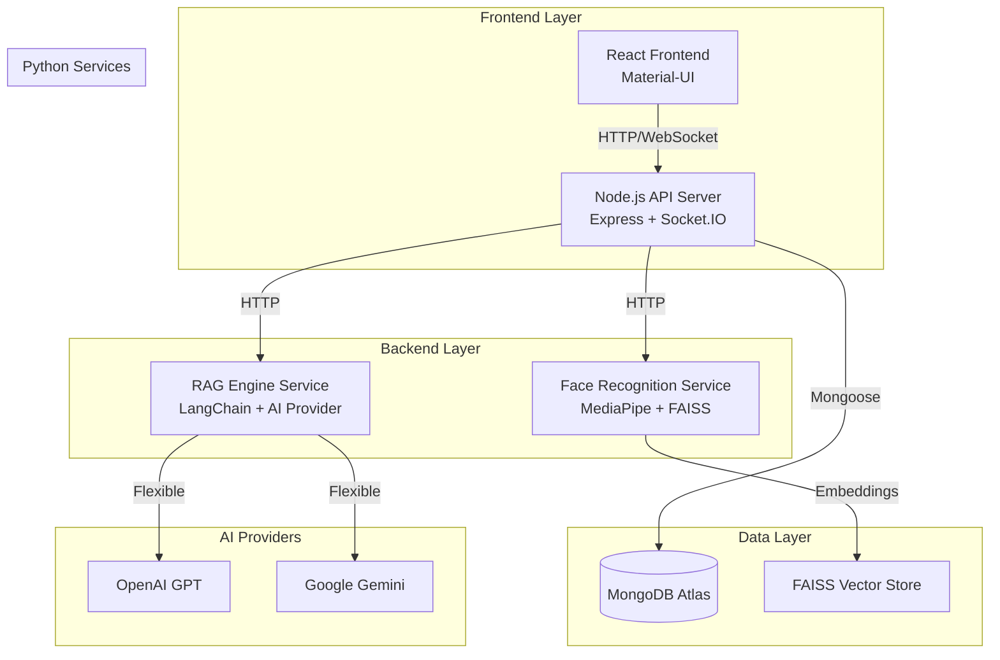

# 🎯 Katomaran Face AI & RAG Platform

A comprehensive **Facial Recognition and Real-time AI Q&A Platform** built for the Katomaran AI Hackathon. This platform combines advanced face recognition capabilities with intelligent conversational AI to create a seamless user experience.

## 🌟 Features

### 🔍 **Face Recognition**
- **Real-time face detection** using MediaPipe
- **High-accuracy face encoding** with FAISS vector similarity search
- **Live webcam integration** with instant recognition
- **Face registration** with quality assessment and confidence scoring
- **Persistent storage** in MongoDB Atlas

### 🤖 **Intelligent Chat System**
- **Flexible AI Provider Support**: Switch between OpenAI and Google Gemini
- **Context-aware responses** about registered faces and database statistics
- **Conversation memory** with persistent chat history
- **Real-time WebSocket communication**
- **RAG (Retrieval-Augmented Generation)** for accurate face data queries

### 🎨 **Modern Web Interface**
- **React 18** with Material-UI components
- **Real-time face recognition** with live camera feed
- **Interactive chat interface** with typing indicators
- **Responsive design** for desktop and mobile
- **Real-time updates** via WebSocket connections

## 🏗️ Architecture



## 🚀 Quick Start

### Prerequisites
- **Node.js** 18+ and npm
- **Python** 3.8+ with pip
- **MongoDB Atlas** account (or local MongoDB)
- **AI API Key** (OpenAI or Google Gemini)

### 1. Clone Repository
```bash
git clone <repository-url>
cd katomaran-faceai-rag-platform
```

### 2. Install Dependencies
```bash
# Install all dependencies with one command
npm run install-all
```

### 3. Setup Python Virtual Environment
```bash
cd python-services
python -m venv venv

# Activate virtual environment
# Windows:
venv\Scripts\activate
# Linux/Mac:
source venv/bin/activate

# Install Python dependencies
pip install -r requirements.txt
```

### 4. Environment Configuration

#### Backend Configuration (`backend/.env`)
```env
# MongoDB Configuration
MONGODB_URI=mongodb+srv://your-connection-string

# Server Configuration
PORT=5000
NODE_ENV=development

# Python Services URLs
FACE_RECOGNITION_SERVICE_URL=http://localhost:8001
RAG_SERVICE_URL=http://localhost:8002

# CORS Configuration
FRONTEND_URL=http://localhost:3000

# Logging Configuration
LOG_LEVEL=info
LOG_FILE=logs/app.log
```

#### Python Services Configuration (`python-services/.env`)
```env
# AI Configuration - Choose your preferred AI provider
# Set AI_PROVIDER to either "openai" or "gemini"
AI_PROVIDER=gemini

# OpenAI Configuration
OPENAI_API_KEY=your_openai_api_key_here

# Google AI Configuration (currently active)
GOOGLE_API_KEY=your_gemini_api_key_here

# Service Configuration
FACE_SERVICE_HOST=0.0.0.0
FACE_SERVICE_PORT=8001
RAG_SERVICE_HOST=0.0.0.0
RAG_SERVICE_PORT=8002

# Logging Configuration
LOG_LEVEL=INFO
```

### 5. Start All Services
```bash
# Single command starts everything
npm run dev
```

This command automatically:
- Starts the backend server (Node.js)
- Starts the frontend development server (React)
- Activates Python virtual environment and starts face recognition service
- Activates Python virtual environment and starts RAG engine service

### 6. Access the Application
- **Frontend**: http://localhost:3000
- **Backend API**: http://localhost:5000
- **Face Recognition Service**: http://localhost:8001
- **RAG Engine Service**: http://localhost:8002

## 🔧 Configuration

### Switching AI Providers

The platform supports both OpenAI and Google Gemini. To switch providers:

#### Method 1: Environment Variable
```bash
# In python-services/.env
AI_PROVIDER=openai  # or "gemini"
OPENAI_API_KEY=your_openai_key
GOOGLE_API_KEY=your_gemini_key
```

#### Method 2: Runtime API Call
```bash
curl -X POST http://localhost:8002/switch-provider \
  -H "Content-Type: application/json" \
  -d '{"provider": "openai", "api_key": "your_openai_key"}'
```

### Logging Configuration

Logs are organized by service:
- **Backend**: `backend/logs/`
- **Face Recognition**: `python-services/logs/face_recognition_service.log`
- **RAG Engine**: `python-services/logs/rag_service.log`

Set log levels via environment variables:
```env
LOG_LEVEL=DEBUG  # DEBUG, INFO, WARNING, ERROR
```

## 📊 API Documentation

### Face Recognition Endpoints
- `POST /register` - Register a new face
- `POST /recognize` - Recognize faces in an image
- `GET /health` - Service health check

### RAG Engine Endpoints
- `POST /query` - Process natural language queries
- `GET /health` - Service health check
- `POST /switch-provider` - Switch AI provider
- `POST /test` - Test functionality

### Backend Endpoints
- `POST /api/faces/register` - Register face via backend
- `POST /api/chat/query` - Chat with AI about faces
- `GET /health` - Overall system health

## 🧪 Testing

### Run Tests
```bash
npm test                    # Run all tests
cd backend && npm test      # Backend tests only
cd frontend && npm test     # Frontend tests only
```

### Manual Testing
1. **Face Registration**: Upload an image and register a face
2. **Live Recognition**: Use webcam to recognize registered faces
3. **Chat Queries**: Ask questions about registered faces
4. **Provider Switching**: Test switching between OpenAI and Gemini

## 🎥 Demo Video

**[Demo Video Link]**: [Insert your Loom video link here]

*The demo video showcases:*
- Face registration process
- Live face recognition
- AI chat functionality
- Provider switching capabilities
- Real-time WebSocket features

## 🔍 Assumptions Made

1. **AI Provider Preference**: Defaulted to Google Gemini for cost-effectiveness and performance
2. **Database Choice**: MongoDB Atlas for scalability and ease of deployment
3. **Face Recognition**: MediaPipe chosen for accuracy and real-time performance
4. **Frontend Framework**: React with Material-UI for modern, responsive design
5. **Deployment**: Designed for containerized deployment with Docker support
6. **Security**: Basic rate limiting and CORS protection implemented
7. **Scalability**: Microservices architecture for horizontal scaling

## 🛠️ Development

### Project Structure
```
katomaran-faceai-rag-platform/
├── frontend/                 # React frontend
├── backend/                  # Node.js API server
├── python-services/          # Python microservices
│   ├── face_recognition/     # Face recognition service
│   └── rag_engine/          # RAG engine service
├── docs/                    # Documentation
└── scripts/                 # Utility scripts
```

### Contributing
1. Fork the repository
2. Create a feature branch
3. Make your changes
4. Add tests
5. Submit a pull request


---

**This project is a part of a hackathon run by https://katomaran.com**
