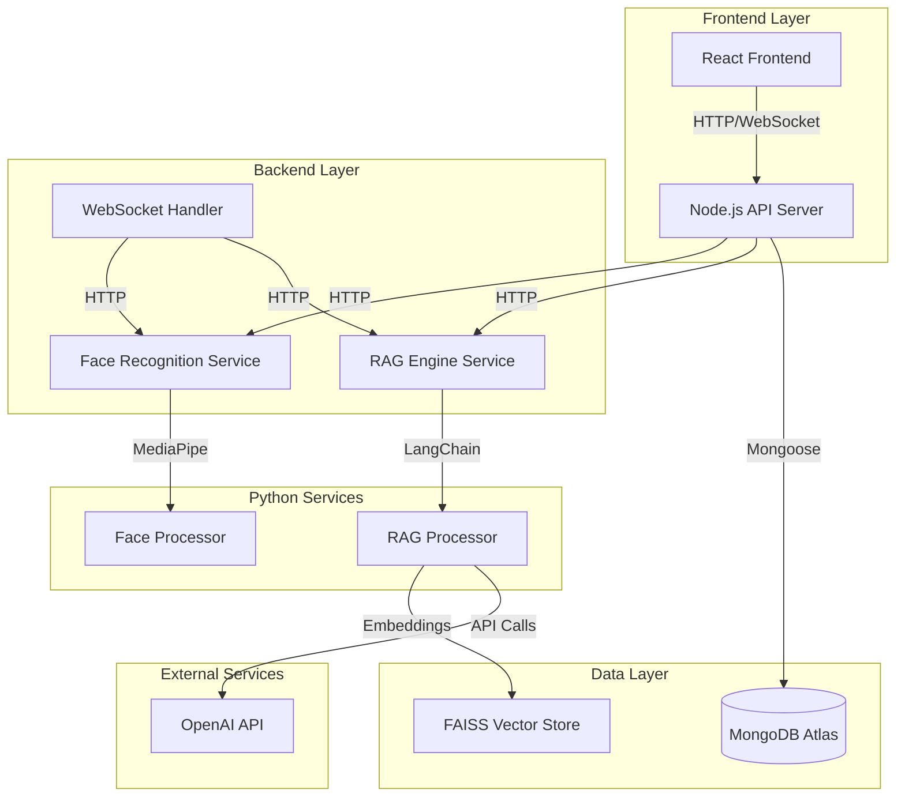

# System Architecture

## Overview

The Katomaran Face AI & RAG Platform is built using a microservices architecture with clear separation of concerns:

- **Frontend**: React-based user interface
- **Backend**: Node.js API server with WebSocket support
- **Python Services**: Face recognition and RAG processing
- **Database**: MongoDB Atlas for data persistence
- **External APIs**: OpenAI for LLM capabilities

## Component Diagram



## Data Flow

### Face Registration Flow
1. User uploads image via React frontend
2. Frontend sends image to Node.js backend
3. Backend forwards image to Python Face Recognition Service
4. Face Recognition Service processes image with MediaPipe
5. Face encoding is generated and returned
6. Backend stores encoding in MongoDB
7. Success response sent back to frontend

### Live Recognition Flow
1. Frontend captures webcam frames
2. Frames sent via WebSocket to backend
3. Backend forwards frames to Face Recognition Service
4. Service processes frames and returns detected faces
5. Backend queries MongoDB for matching encodings
6. Recognition results sent back via WebSocket
7. Frontend displays results with bounding boxes

### Chat Query Flow
1. User sends message via chat interface
2. Message sent to backend via WebSocket or HTTP
3. Backend gathers face data context from MongoDB
4. Context and message sent to RAG Engine Service
5. RAG Engine processes query using LangChain + FAISS + OpenAI
6. Response generated and sent back to frontend
7. Frontend displays AI response

## Service Details

### Frontend (React + TypeScript)
- **Port**: 3000 (development)
- **Technologies**: React 18, Material-UI, Socket.IO Client, Axios
- **Responsibilities**:
  - User interface for all features
  - Webcam access and frame capture
  - Real-time communication via WebSocket
  - State management and UI updates

### Backend (Node.js + Express)
- **Port**: 5000
- **Technologies**: Express, Socket.IO, Mongoose, Winston
- **Responsibilities**:
  - REST API endpoints
  - WebSocket connection management
  - Database operations
  - Request routing to Python services
  - Authentication and rate limiting

### Face Recognition Service (Python + FastAPI)
- **Port**: 8001
- **Technologies**: FastAPI, MediaPipe, OpenCV, NumPy
- **Responsibilities**:
  - Face detection using MediaPipe
  - Face encoding generation
  - Image preprocessing and quality assessment
  - Bounding box calculation

### RAG Engine Service (Python + FastAPI)
- **Port**: 8002
- **Technologies**: FastAPI, LangChain, FAISS, OpenAI
- **Responsibilities**:
  - Natural language query processing
  - Vector embeddings generation
  - Similarity search in vector store
  - LLM response generation
  - Conversation context management

## Database Schema

### Face Collection
```javascript
{
  _id: ObjectId,
  name: String,
  encoding: [Number], // 128-dimensional array
  registered_at: Date,
  metadata: {
    confidence: Number,
    image_quality: String,
    face_landmarks: Object
  },
  is_active: Boolean,
  createdAt: Date,
  updatedAt: Date
}
```

### Indexes
- `name`: Text index for search
- `registered_at`: Date index for temporal queries
- `is_active`: Boolean index for active records

## API Specifications

### REST Endpoints

#### Face Management
- `POST /api/faces/register`
  - Body: FormData with image and name
  - Response: Registration result with encoding metadata

- `POST /api/faces/recognize`
  - Body: FormData with image
  - Response: Array of recognized faces with confidence scores

- `GET /api/faces`
  - Query: page, limit, search
  - Response: Paginated list of registered faces

- `DELETE /api/faces/:id`
  - Response: Deletion confirmation

#### Chat Interface
- `POST /api/chat/query`
  - Body: { message, conversation_id }
  - Response: AI response with sources and metadata

- `GET /api/chat/conversations/:id`
  - Response: Conversation history

### WebSocket Events

#### Face Recognition
- `start_recognition`: Begin live recognition
- `stop_recognition`: Stop live recognition
- `process_frame`: Send frame for processing
- `recognition_result`: Receive recognition results
- `recognition_error`: Error in processing

#### Chat
- `chat_message`: Send chat message
- `chat_response`: Receive AI response
- `chat_error`: Error in chat processing

## Security Considerations

### Data Protection
- Face encodings stored as numerical vectors (not images)
- No raw images stored in database
- Environment variables for sensitive configuration

### API Security
- Rate limiting on all endpoints
- Input validation and sanitization
- CORS configuration
- Request size limits

### Authentication
- Currently open for hackathon demo
- Ready for JWT implementation
- Role-based access control structure in place

## Scalability Considerations

### Horizontal Scaling
- Stateless backend services
- Load balancer ready
- Database connection pooling
- WebSocket clustering support

### Performance Optimization
- Image compression before processing
- Frame rate throttling for live recognition
- Vector store caching
- Database query optimization

### Resource Management
- Memory-efficient face encoding storage
- Cleanup of temporary files
- Connection pooling
- Graceful shutdown handling

## Deployment Architecture

### Development
```
localhost:3000 (Frontend)
localhost:5000 (Backend)
localhost:8001 (Face Recognition)
localhost:8002 (RAG Engine)
MongoDB Atlas (Cloud)
```

### Production
```
CDN/Static Hosting (Frontend)
Load Balancer → Backend Instances
Container Orchestration (Python Services)
MongoDB Atlas (Cloud)
Redis (Session/Cache)
```

## Monitoring and Logging

### Logging Strategy
- Structured logging with Winston (Backend)
- Python logging module (Services)
- Request/response logging
- Error tracking and alerting

### Metrics
- API response times
- Face recognition accuracy
- WebSocket connection health
- Database query performance
- Memory and CPU usage

## Error Handling

### Frontend
- User-friendly error messages
- Retry mechanisms for failed requests
- Graceful degradation for offline scenarios

### Backend
- Comprehensive error middleware
- Proper HTTP status codes
- Detailed error logging
- Circuit breaker pattern for external services

### Python Services
- Exception handling with proper responses
- Service health checks
- Timeout management
- Resource cleanup

## Future Architecture Enhancements

### Planned Improvements
- Microservice containerization with Docker
- Kubernetes orchestration
- Redis for caching and sessions
- Message queue for async processing
- API Gateway for service mesh
- Monitoring with Prometheus/Grafana

### Scalability Roadmap
- Multi-region deployment
- CDN integration
- Database sharding
- Caching layers
- Auto-scaling policies
